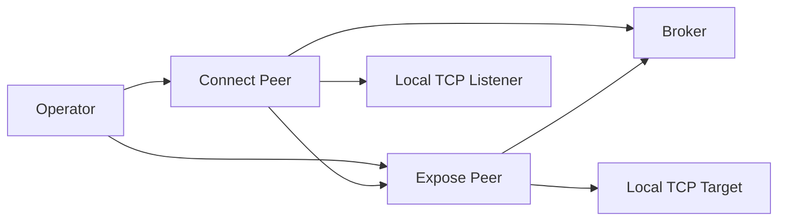

# rtc2tcp Threat Model

## Executive Summary

`rtc2tcp` is a Go-based broker plus peer CLI that exposes a single local TCP service over WebRTC DataChannels. The broker trust boundary, pre-auth protocol misuse, and signaling/session confusion risks are the remaining high-priority areas now that Milestone 2 has replaced the placeholder authenticator with CPACE-Ristretto255 via `github.com/cloudflare/circl/group`. The broker is intentionally out of the payload path, but it still handles pairing and relays SDP/ICE, so protocol correctness at that boundary is security-critical.

## Scope and Assumptions

In scope:

- `cmd/rtc2tcp-broker`
- `cmd/rtc2tcp-peer`
- `internal/signaling`
- `internal/rendezvous`
- `internal/webrtc`
- `internal/auth`
- `internal/tunnel`
- `internal/config`

Out of scope:

- third-party library internals
- deployment-specific TLS termination outside the broker process
- STUN/TURN service implementations

Assumptions:

- Intended usage is local/lab and security-research-oriented, not malware or stealth deployment.
- Peers may use an untrusted public broker for rendezvous.
- TURN may relay encrypted transport packets but must not terminate tunnel payload encryption.
- Peer authentication is a balanced CPACE-Ristretto255 PAKE. Its PAKE-level guarantees (offline guessing is infeasible, online guesses require an interactive session) are assumed to hold as specified in the CFRG CPACE draft for the Ristretto255 variant. The `github.com/cloudflare/circl` group implementation is assumed correct; the rtc2tcp integration code has not yet been externally audited.

Open questions that would change risk ranking:

- Whether the project will support browser peers later.
- Whether public brokers will accept untrusted internet-wide traffic or stay lab-scoped.

## System Model

### Primary Components

- Broker HTTP/WebSocket server in `cmd/rtc2tcp-broker/main.go` and `internal/rendezvous/broker.go`
- Peer CLI orchestration in `cmd/rtc2tcp-peer/main.go`
- Broker signaling client in `internal/signaling/client.go`
- WebRTC session and control channel handling in `internal/webrtc/session.go`
- Interactive CPACE-Ristretto255 auth subsystem in `internal/auth/auth.go`
- TCP bridging in `internal/tunnel/bridge.go`

### Data Flows and Trust Boundaries

- Operator -> Peer CLI
  - Data: `rendezvous_token`, `pairing_secret`, broker/STUN/TURN endpoints, target/listen addresses
  - Channel: command-line flags, environment variables, secret files
  - Security guarantees: local host control only; no broker visibility for pairing secret after local load
  - Validation: token, broker URL, mode, and endpoint validation in peer config and signaling

- Peer -> Broker
  - Data: registration metadata, SDP, ICE, session lifecycle
  - Channel: WebSocket
  - Security guarantees: `wss://` required outside localhost, message size limits, origin restrictions on broker side
  - Validation: registration-first protocol, mode checks, paired-session enforcement

- Peer -> Peer
  - Data: control-channel auth messages, payload DataChannels, TCP stream contents
  - Channel: WebRTC DataChannel over DTLS/SCTP
  - Security guarantees: transport encryption from WebRTC; protocol gating to prevent pre-auth payload use
  - Validation: session state machine, control-vs-payload channel separation, fingerprint-based binding material

- Expose Peer -> Local Target
  - Data: authenticated TCP stream bytes
  - Channel: local TCP
  - Security guarantees: only after peer auth and stream gating
  - Validation: target address is operator-supplied; no application-layer protocol validation

#### Diagram

## Assets and Security Objectives

| Asset | Why it matters | Security objective |
| --- | --- | --- |
| Pairing secret | Drives peer authentication correctness | C/I |
| Session binding material | Prevents broker or peer-session mix-up | I |
| TCP payload bytes | Carries tunneled application data | C/I |
| Broker availability | Required for rendezvous and signaling | A |
| Peer local target connectivity | Determines what service is exposed | I/A |
| Build artifacts and protocol docs | Needed for auditability and reproducibility | I |

## Attacker Model

### Capabilities

- A malicious broker operator can observe and modify signaling traffic.
- A network attacker can reach a public broker endpoint.
- A malicious peer can attempt protocol misuse, replay, or stream-before-auth behavior.
- A local user on the peer host can inspect CLI history, environment, or files if the operator handles secrets poorly.

### Non-Capabilities

- The broker does not see TCP payload plaintext if WebRTC transport setup is otherwise correct.
- The broker is not intended to relay tunneled payload bytes.
- This model does not assume kernel compromise or local admin compromise on both peer hosts.

## Entry Points and Attack Surfaces

| Surface | How reached | Trust boundary | Notes | Evidence |
| --- | --- | --- | --- | --- |
| Broker WebSocket `/ws` | Remote network client | Internet/broker boundary | Registration and signaling entrypoint | `cmd/rtc2tcp-broker/main.go`, `internal/rendezvous/broker.go` |
| Peer CLI flags/env/files | Local operator input | Operator/peer boundary | Secrets and broker coordinates enter here | `cmd/rtc2tcp-peer/main.go`, `internal/config` |
| Signaling messages | Broker-relayed JSON | Broker/peer boundary | SDP, ICE, errors, session metadata | `internal/signaling/types.go`, `internal/signaling/client.go` |
| Inbound DataChannel labels/messages | Remote peer over WebRTC | Peer/peer boundary | Control and payload misuse can cross here | `internal/webrtc/session.go` |
| Local TCP listener | Local client connection | Local app/peer boundary | `connect` mode accepts plaintext local clients | `cmd/rtc2tcp-peer/main.go` |
| Local TCP target dial | Peer to local target | Peer/local service boundary | `expose` mode dials privileged or sensitive services if configured carelessly | `cmd/rtc2tcp-peer/main.go`, `internal/tunnel/bridge.go` |

## Top Abuse Paths

1. Broker observes a reused `rendezvous_token`, pairs attacker-controlled peers, and drives signaling confusion to force denial of service or session mix-up.
2. Malicious peer opens a payload DataChannel before auth to trigger target dialing or stream handling before identity is checked.
3. Malicious broker rewrites SDP fingerprints or sessions to confuse the current placeholder auth binding.
4. Remote client floods broker or peer with oversized WebSocket messages to exhaust memory or stall signaling loops.
5. Operator passes secrets directly on the CLI and leaks them through shell history or process inspection.
6. Malicious origin or browser context connects to the broker if origin handling is overly permissive.

## Threat Model Table

| Threat ID | Threat source | Prerequisites | Threat action | Impact | Impacted assets | Existing controls (evidence) | Gaps | Recommended mitigations | Detection ideas | Likelihood | Impact severity | Priority |
| --- | --- | --- | --- | --- | --- | --- | --- | --- | --- | --- | --- | --- |
| TM-001 | Malicious broker | Broker can alter signaling | Rewrite or replay SDP/ICE to confuse peer session binding | Session integrity loss or DoS | Session binding material, broker availability | CPACE-Ristretto255 with transcript binding over scheme, session id, both roles, both application-section fingerprints, and both raw shares; role-separated HMAC key confirmation under `crypto/subtle` compare | Integration code not yet externally audited; no rate limiting on auth failures; no operator-visible auth-failure telemetry | External audit of integration and primitive usage; auth-failure counters and structured logs | Count authentication failures per rendezvous token and per broker session | low | high | medium |
| TM-002 | Malicious peer | Broker paired the peer | Open payload channels before auth | Unauthorized pre-auth stream handling or target dialing | TCP target connectivity, payload integrity | `OpenStreamChannel` auth gate in `internal/webrtc/session.go` | No explicit full state machine in baseline | Enforce state machine and hard fail on any pre-auth payload channel | Count protocol violations and close reasons | high | high | high |
| TM-003 | Remote broker client | Network access to broker | Send oversized or malformed WebSocket messages | Broker or peer resource exhaustion | Broker availability | Registration-first flow in `internal/rendezvous/broker.go` | No explicit read limits in baseline | Add read limits and strict parsing/error paths | Log size-limit violations and pairing failures | medium | medium | medium |
| TM-004 | Web attacker using browser origin | Broker reachable from browser context | Abuse permissive origin policy to interact with broker | Broker abuse and pairing noise | Broker availability | None in baseline; `CheckOrigin` was permissive | Cross-origin abuse allowed | Restrict broker origin policy and prefer no browser origin support in MVP | Log rejected origins | medium | medium | medium |
| TM-005 | Local observer on peer host | Access to shell history or process list | Recover pairing secret from CLI flags | Peer impersonation within current auth model | Pairing secret | None if operator uses `--secret`/`--pairing-secret` | CLI path is too prominent | Add secret-file and env loading; demote direct CLI usage | Audit docs and operator guidance | medium | medium | medium |

## Criticality Calibration

- `critical`
  - Silent peer impersonation despite the CPACE-Ristretto255 handshake (e.g., a flaw in the integration that lets key confirmation succeed without mutual possession of the pairing secret)
  - Payload relay through broker contrary to design
- `high`
  - Pre-auth payload channel acceptance
  - Broker/session confusion that breaks session binding
  - Pairing-secret exposure through a side channel on the peer host
- `medium`
  - Broker-targeted DoS through missing limits
  - Cross-origin broker abuse
  - Logging of unnecessary protocol material
- `low`
  - Local developer ergonomics issues that do not change trust boundaries
  - Documentation drift without direct security behavior change

## Focus Paths for Security Review

| Path | Why it matters | Related Threat IDs |
| --- | --- | --- |
| `internal/webrtc/session.go` | Core session state, channel gating, auth sequencing, and fingerprint binding live here | TM-001, TM-002 |
| `internal/auth/auth.go` | Interactive CPACE-Ristretto255 handshake, transcript construction, key schedule, and binding-material handling | TM-001, TM-005 |
| `internal/signaling/client.go` | Broker transport validation and message limits live here | TM-003 |
| `internal/rendezvous/broker.go` | Broker origin checks, pairing, and message relay controls live here | TM-003, TM-004 |
| `cmd/rtc2tcp-peer/main.go` | Secret loading, auth timeout handling, and listener startup sequencing | TM-002, TM-005 |

## Quality Check

- Entry points covered: broker WebSocket, peer CLI/env/files, signaling messages, inbound DataChannels, local listener, local target dial
- Trust boundaries represented in threats: operator/peer, peer/broker, peer/peer, peer/local target
- Runtime scope separated from third-party libraries and out-of-scope deployment infrastructure
- Assumptions are explicit and no security claim depends on hidden context
